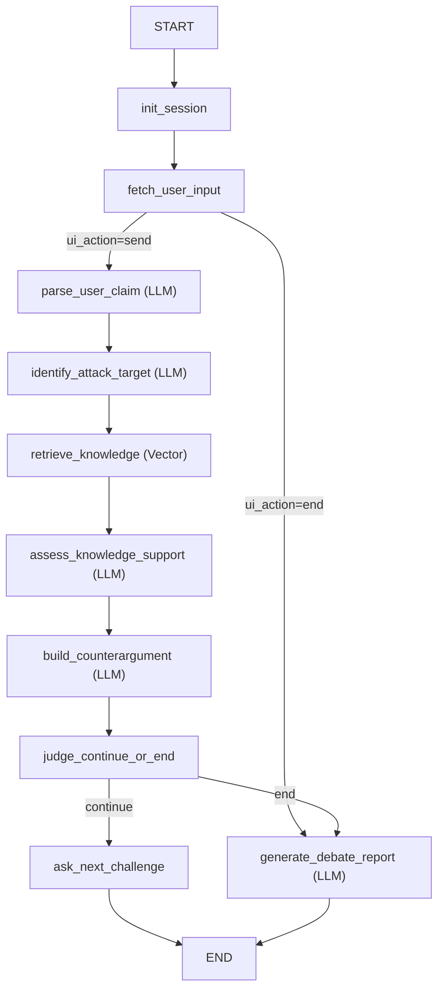

# 法律辩论 Agent Demo（LangGraph + MiniMax + Streamlit）

> 面向中国大陆大学生维权场景的辩论陪练最小可用版本（MVP）

## 项目说明

本项目实现“高校学生维权智能体平台”中的 **辩论陪练 Agent**。
当前版本重点是：

- LangGraph 单轮交互流程可运行
- 关键节点由 LLM 驱动（含异常兜底）
- 本地示例知识库可被检索并注入反驳生成
- 提供 Streamlit 可视化前端用于节点与会话测试
- 结束后输出结构化辩论报告（页面底部报告区域展示）

> 说明：当前知识与输出用于 Demo 演示，不构成正式法律意见。

## 运行方式

### 1. 安装依赖

```bash
pip install -r requirements.txt
```

### 2. 配置 `.env`

```dotenv
OPENAI_BASE_URL=https://api.minimaxi.com/v1
OPENAI_API_KEY=<YOUR_MINIMAX_KEY>
MINIMAX_MODEL=MiniMax-M2.5
```

### 3. 启动后端 API（Next.js 联调）

```bash
uvicorn app.api.app:app --reload --host 0.0.0.0 --port 8000
```

### 4. 启动 Streamlit 前端（回归基线）

```bash
streamlit run streamlit_app.py
```

### 5. 启动 CLI 调试入口

```bash
python main.py
```

CLI 输入 `/end` 或 `结束` 可直接结束辩论并生成报告。

### 6. 构建与更新向量索引（正式检索）

```bash
python -m app.knowledge.index_cli build --knowledge-dir knowledge --index-dir knowledge/.vector_store
python -m app.knowledge.index_cli update --knowledge-dir knowledge --index-dir knowledge/.vector_store
python -m app.knowledge.index_cli verify --index-dir knowledge/.vector_store
```

> 新增 JSONL 记录后，执行 `update` 即可把新知识纳入向量库。

### 7. 模型缓存硬约束（必须在 D 盘）

本项目会在运行向量检索前强制校验以下缓存目录必须位于 `D:\`：

- `HF_HOME`
- `SENTENCE_TRANSFORMERS_HOME`
- `TRANSFORMERS_CACHE`
- `TORCH_HOME`
- `XDG_CACHE_HOME`

如需手动设置，可使用：

```powershell
$env:HF_HOME="D:\tencentKAIWU\Debate_partner\.model_cache\hf_home"
$env:SENTENCE_TRANSFORMERS_HOME="D:\tencentKAIWU\Debate_partner\.model_cache\sentence_transformers"
$env:TRANSFORMERS_CACHE="D:\tencentKAIWU\Debate_partner\.model_cache\transformers"
$env:TORCH_HOME="D:\tencentKAIWU\Debate_partner\.model_cache\torch"
$env:XDG_CACHE_HOME="D:\tencentKAIWU\Debate_partner\.model_cache\xdg"
```

## API 文档（Next.js 对接）

已提供可运行的 v1 API 实现与契约文档：

- 人读版：`docs/API_V1.md`
- 机器版：`docs/openapi/debate-agent-v1.yaml`
- 前端 agent 指南：`docs/FRONTEND_AGENT_GUIDE.md`

接口基路径统一为：`/api/v1`，首批接口包含：

- `POST /sessions`
- `POST /sessions/{session_id}/turn`
- `GET /sessions/{session_id}`
- `GET /health`

建议联调时先对照 `docs/API_V1.md` 的 `send`/`end` 示例，再用 OpenAPI 文件做契约校验。

## 前端页面行为

- 顶部预设：`case_background`、`scenario_hint`、`max_rounds`
- 场景下拉固定值：
  - `rental_dispute`
  - `part_time_wage`
  - `campus_loan`
  - `training_refund`
  - `student_rights`
- 对话区：用户消息在右侧、Agent 消息在左侧
- Agent 主回复只展示两段：
  - `核心反驳`
  - `进一步追问`
- 每条 Agent 消息右上角有 `详情` 按钮，展开后可查看完整分段内容
- 页面底部独立展示 `辩论总结报告`
- 页面底部新增 `节点观测（测试用）`：可查看节点链路状态、结构化反驳、引用映射、debug 与历史快照
- 系统会保存并在生成下一轮时注入最近历史（用于保持论点连续、减少重复）
- `send` 文本中包含“结束”等词不会提前结束；结束仅由 `action=end` 或达到最大轮次触发

## LangGraph 图（单轮交互）



> 单轮语义：每次 `graph.invoke` 只处理一次用户动作（`send` 或 `end`），处理完成即 `END`。

## 状态迁移说明（重点）

- 已移除：`pending_user_inputs`
- 新增：`ui_action`（`send | end`）
- 新增输入治理字段：
  - `normalized_user_input`
  - `input_valid`
  - `input_error_code`
  - `input_error_message`
- 新增结束治理字段：
  - `end_reason_code`（`IN_PROGRESS | USER_ENDED | MAX_ROUNDS_REACHED`）
- 新增攻击点元数据字段：
  - `attack_target_category`
  - `attack_target_reason`
  - `attack_target_source`（`llm | fallback | reranked`）
- 新增检索治理字段：
  - `retrieval_mode`（`vector | keyword_fallback`）
  - `knowledge_sufficiency`
  - `knowledge_missing_aspects`
- 新增反驳结构化字段（兼容保留文本稿）：
  - `counterargument_structured`
  - `counterargument_citations`
  - `counterargument_quality_flags`
  - 角色漂移治理标记：`role_drift_repaired`、`role_drift_fallback_used`
  - 兼容字段 `counterargument_draft`、`followup_question` 继续保留
- 新增报告可观测字段：
  - `report_source`（`llm | fallback`）
  - `report_quality_flags`
- 每轮历史新增双轨回复字段：
  - `assistant_brief`：仅“核心反驳 + 进一步追问”
  - `assistant_detail`：完整分段内容
- 每轮历史新增结构化快照字段（用于回放/复盘）：
  - `counterargument_structured_snapshot`
  - `counterargument_citations_snapshot`
  - `counterargument_quality_flags`
- `fetch_user_input` 后新增无效输入短路（`send` + 空文本不会进入解析链）
- `build_counterargument` 新增角色漂移守卫：检测到“替用户站队”后先重试 1 次，仍异常则 fallback，确保最终输出维持反方立场

## 目录结构（核心）

```text
Debate_partner/
├─ main.py
├─ streamlit_app.py
├─ requirements.txt
├─ app/
│  ├─ graph/
│  │  ├─ builder.py
│  │  ├─ nodes/debate_nodes.py
│  │  └─ schemas/state.py
│  ├─ api/
│  │  ├─ app.py
│  │  ├─ errors.py
│  │  ├─ mappers.py
│  │  ├─ models.py
│  │  └─ store.py
│  ├─ knowledge/repository.py
│  ├─ knowledge/vector_store.py
│  ├─ knowledge/index_cli.py
│  ├─ prompts/debate_prompts.py
│  └─ services/llm_client.py
├─ knowledge/
│  ├─ statutes/statutes.demo.jsonl
│  ├─ cases/cases.demo.jsonl
│  ├─ issue_rules/issue_rules.demo.jsonl
│  └─ rebuttal_templates/rebuttal_templates.demo.jsonl
├─ docs/
│  ├─ API_V1.md
│  ├─ openapi/debate-agent-v1.yaml
│  ├─ PROJECT_CODE_GUIDE.md
│  └─ IMPLEMENTATION_LOG.md
└─ tests/
   ├─ test_api.py
   ├─ test_counterargument_node.py
   ├─ test_graph_routes.py
   ├─ test_input_nodes.py
   ├─ test_reply_views.py
   ├─ test_session_store.py
   └─ test_vector_store.py
```

## 测试

```bash
python -m unittest discover -s tests -p "test_*.py"
```

## 法律与合规提示

- 默认语境：中华人民共和国大陆法域。
- 当前知识内容为 Demo 级示例，含示意化条文与 mock 案例。
- 输出仅用于训练与原型演示，不构成正式法律意见。

运行命令：
后端：uvicorn app.api.app:app --reload --host 0.0.0.0 --port 8000
前端：npm run dev