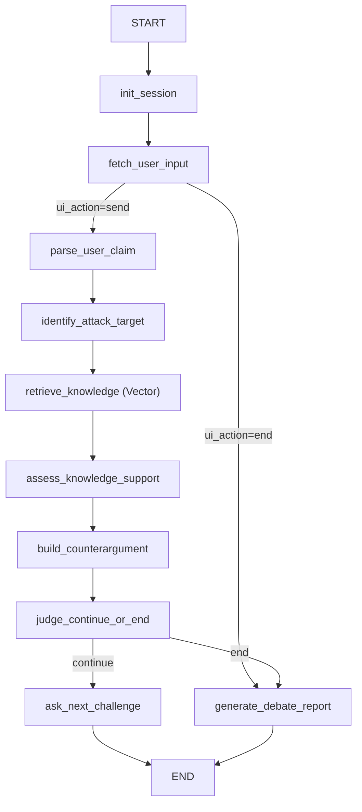

# 项目代码说明文档（LangGraph 法律辩论 Agent）

> 目标：帮助后续开发者快速理解当前项目结构，并按节点逐步完善逻辑。  
> 版本：前端接入后的“单轮交互”版本。

## 1. 项目整体架构

项目分成五层：

1. **流程编排层（Graph）**  
   负责 StateGraph、节点顺序、条件路由与单轮收敛。

2. **能力层（Services/Prompts/Knowledge）**  
   负责模型调用、提示词构造、本地知识检索。

3. **服务接口层（FastAPI）**  
   负责 `/api/v1` 会话接口、错误契约、会话存储与 Graph 调用编排。

4. **前端层（Streamlit）**  
   负责参数预设、对话展示、详情展开、报告展示。

5. **数据层（knowledge/*.jsonl）**  
   负责法条/案例/争点规则/反驳模板的原始知识内容。

## 2. 文件与职责总览

### 2.1 入口与配置

- `streamlit_app.py`  
  前端入口，驱动单轮 `graph.invoke`，维护会话状态。

- `main.py`  
  CLI 调试入口（逐轮输入模式）。

- `app/api/app.py`  
  FastAPI 入口，提供 `/api/v1` 4 个接口。

- `.env` / `.env.example`  
  模型调用配置。

- `requirements.txt`  
  依赖列表（含 `streamlit`）。

### 2.2 LangGraph 编排层

- `app/graph/builder.py`  
  图定义中心：注册节点、条件分流与 `END` 收敛。

- `app/graph/schemas/state.py`  
  状态结构定义（`DebateState` 及子结构）。

- `app/graph/nodes/debate_nodes.py`  
  节点实现、回复分段器、报告生成逻辑。

### 2.3 服务接口层

- `app/api/store.py`
  内存会话存储（24h TTL）与并发安全更新。

- `app/api/models.py`
  API 请求/响应模型定义。

- `app/api/mappers.py`
  `DebateState -> SessionStateSummary` 映射。

- `app/api/errors.py`
  统一业务异常定义。

### 2.4 能力层

- `app/services/llm_client.py`  
  MiniMax OpenAI 兼容客户端。

- `app/prompts/debate_prompts.py`  
  各 LLM 节点 Prompt 模板。

- `app/knowledge/repository.py`  
  本地 JSONL 加载 + 向量优先检索（失败时关键词兜底）。

### 2.5 数据层

- `knowledge/statutes/statutes.demo.jsonl`
- `knowledge/cases/cases.demo.jsonl`
- `knowledge/issue_rules/issue_rules.demo.jsonl`
- `knowledge/rebuttal_templates/rebuttal_templates.demo.jsonl`

## 3. 更新后的 LangGraph 图结构



### 3.1 路由语义

- `fetch_user_input` 根据 `ui_action` 决定：
  - `end`：直接生成报告
  - `send`：进入攻防链路
- `judge_continue_or_end` 决定：
  - `continue`：产出当轮回复后结束本次 invoke
  - `end`：直接进入报告节点并结束本次 invoke

> 当前图是“单轮闭环图”：每次 `invoke` 都会在一次用户动作后落到 `END`。

## 4. State 定义（字段级）

`DebateState` 定义在 `app/graph/schemas/state.py`。

### 4.1 会话配置字段

- `session_id`: 会话 ID
- `case_background`: 案件背景
- `scenario_hint`: 场景提示（影响检索加权）
- `max_rounds`: 最大轮次

### 4.2 当前轮输入与控制字段

- `current_user_input`: 当前轮用户输入
- `ui_action`: 当前动作（`send` / `end`）
- `round_index`: 已完成轮次计数（0-based）

### 4.3 中间产物字段

- `parsed_claim`
- `attack_target`
- `attack_target_category`
- `attack_target_reason`
- `attack_target_source`
- `retrieved_knowledge`
- `retrieval_mode`
- `knowledge_sufficiency`
- `knowledge_missing_aspects`
- `counterargument_structured`
- `counterargument_citations`
- `counterargument_quality_flags`
- `counterargument_draft`
- `followup_question`

### 4.4 回复展示字段（新增重点）

- `assistant_reply`: 兼容字段，当前等同 `assistant_brief`
- `assistant_brief`: 前端主回复，仅两段
  - `核心反驳`
  - `进一步追问`
- `assistant_detail`: 完整分段内容（主张概括/法律依据/案例思路/证据质疑/逻辑质疑等）

### 4.5 历史与收敛字段

- `debate_history`: 每轮记录（含 `assistant_brief` + `assistant_detail`）
- `previous_user_inputs`: 历史用户输入
- `no_new_argument_streak`: 连续无新论点计数
- `should_end`: 是否结束
- `end_reason`: 结束原因
- `end_reason_code`: 结束码（`IN_PROGRESS | USER_ENDED | MAX_ROUNDS_REACHED`）

### 4.6 报告与调试字段

- `report`: 结构化报告
- `report_source`: 报告来源（`llm | fallback`）
- `report_quality_flags`: 报告修复/降级质量标签
- `debug`: 调试信息

### 4.7 与旧版本差异

- 已删除 `pending_user_inputs`。输入来源改为前端输入框/CLI 实时输入。

## 5. 节点定义（更新版）

### 5.1 `init_session`

- 初始化或补全流程字段。
- 保留历史与报告上下文，重置 `should_end`。

### 5.2 `fetch_user_input`

- 规范化 `current_user_input` 和 `ui_action`。
- 不再从预设数组读取输入。

### 5.3 `parse_user_claim`（LLM）

- 把用户输入结构化为 `ParsedClaim`。
- Prompt 会携带最近历史摘要，避免脱离上下文。
- 失败时走本地兜底。

### 5.4 `identify_attack_target`（LLM）

- 选择优先攻击点。
- 会参考最近历史，尽量避免与前一轮重复攻击点。
- 失败时回退规则选择。

### 5.5 `retrieve_knowledge`

- 根据用户输入、攻击点与 claims 执行向量检索（FAISS）。
- 若向量检索不可用，降级到关键词检索，并在 `debug.retrieval` 标记模式与错误码。
- 本地模型缓存硬约束：向量检索启动前会校验缓存目录必须在 `D:\`。

### 5.6 `assess_knowledge_support`（LLM）

- 判断当前检索结果是否足够支撑反方输出。
- 若不足，按结构化格式生成临时补强支撑点（`synthetic_support`），仅当轮注入，不写回知识库。

### 5.6.1 向量索引运维命令

- `python -m app.knowledge.index_cli build`
- `python -m app.knowledge.index_cli update`
- `python -m app.knowledge.index_cli rebuild`
- `python -m app.knowledge.index_cli verify`

### 5.7 `build_counterargument`（LLM）

- 主输出升级为结构化对象（并保留文本兼容）：
  - `counterargument_structured`
  - `counterargument_citations`
  - `counterargument_quality_flags`
  - 兼容字段：`counterargument_draft`、`followup_question`
- 关键段落强引用约束：缺失引用会自动修复并打质量标记。
- 失败时走模板兜底，但不中断图流程。

### 5.8 `judge_continue_or_end`

- 采用“仅显式结束”策略：
  - `ui_action=end` 结束
  - 或达到 `max_rounds` 结束
- “关键词结束”和“连续无新论点结束”不再触发路由，仅保留统计用途。
- 输出标准结束码 `end_reason_code` 并写入 `debug.judge`。

### 5.9 `ask_next_challenge`

- 使用“回复分段器”生成：
  - `assistant_brief`
  - `assistant_detail`
- 写入 `debate_history`，并推进 `round_index + 1`。
- 每轮同时沉淀结构化快照：
  - `counterargument_structured_snapshot`
  - `counterargument_citations_snapshot`
  - `counterargument_quality_flags`

### 5.10 `generate_debate_report`（LLM）

- 四阶段：输入治理 → LLM 输出 → 校验修复 → fallback。
- 约束与修复：
  - 列表字段统一为字符串列表并截断
  - `overall_score` 强制夹紧到 0~100
  - 缺失段落按历史事实补齐
- 输出可观测字段：
  - `report_source`
  - `report_quality_flags`
  - `debug.report`

## 6. 前端集成方式（Streamlit）

文件：`streamlit_app.py`

### 6.1 页面结构

- 顶部：辩论预设（背景、场景、最大轮次）
- 中部：聊天区（用户右、Agent 左）
- 每条 Agent 消息右上角：`详情` 按钮（消息内展开）
- 底部：输入框 + `发送` + `结束辩论`
- 页面底部：`辩论总结报告`
- 页面底部：`节点观测（测试用）`（链路状态、关键字段、结构化反驳、debug、历史快照）

### 6.2 会话状态

- `st.session_state["debate_state"]`：LangGraph state
- `st.session_state["chat_messages"]`：渲染用消息列表
- 页面底部节点观测面板直接消费 `debate_state`，用于节点级回归测试

## 7. 测试说明

测试文件：

- `tests/test_reply_views.py`
  - 校验回复分段器在标准/缺失标签场景下的输出稳定性。

- `tests/test_graph_routes.py`
  - 校验 `send` 与 `end` 路由行为。

运行命令：

```bash
python -m unittest discover -s tests -p "test_*.py"
```

## 8. 后续可扩展方向

1. 将 API 会话存储从内存升级到 Redis（支持多实例部署）。
2. 将“详情”结构改为字段化 JSON，减少文本解析依赖。
3. 增加会话持久化（按 `session_id` 存储完整历史和报告）。
